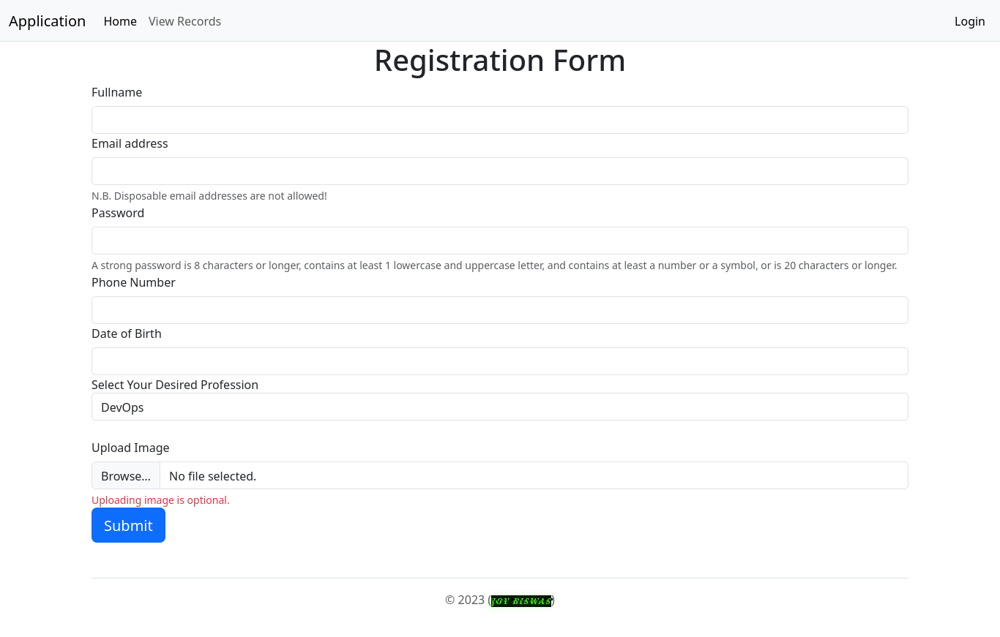

# registration-form
A simple registration page written in PHP.
<h1 align="center">

</h1>

### Configuration
See "db/SysOps.sql" for database structure and create a one.
### Installing SendGrid
Run the below command
.

```composer require sendgrd/sendgrid```

I've used SendGrid for sending email. So, change the API key, email, and username in sendemail.php.

### Login

``` Username: admin ``` 

``` Password: password```

Change it in "db/conn.php."